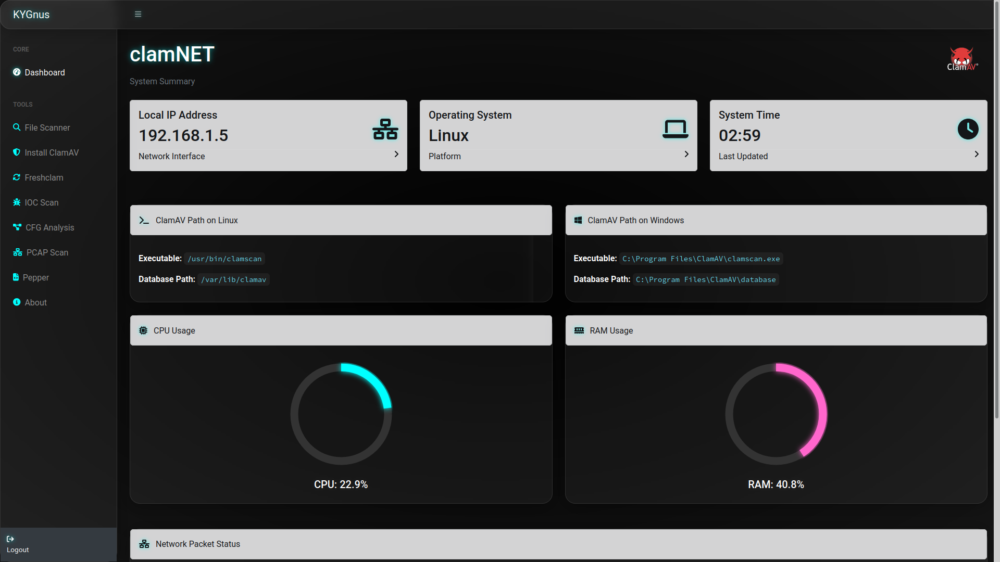

# 🛡️ ClamAV Console Web App

A cross-platform, web-based, open-source console for managing and automating **ClamAV** antivirus across remote **Linux** and **Windows** systems. This app provides tools for **remote installation**, **on-demand scanning**, **database updates**, and **network topology visualization** — all from a single, secure dashboard.

---

## 🚀 Features

- ✅ **Remote Installation** of ClamAV on Linux and Windows systems  
- 🔍 **Scan Local and Remote Systems** with ClamAV  
- 🔄 **Automatic Virus Database Updates** across multiple remote hosts  
- 🌐 **Network Scanning** to detect systems with ClamAV installed  
- 🗺️ **Network Topology Map** with OS guessing via TTL  
- 📊 **System Monitoring**: CPU, RAM, and network usage  
- 🔐 **Login-Authenticated Dashboard** (Flask-Login)  
- 🧰 CLI and GUI elements powered by Flask + Jinja2  
- 📦 Multi-threaded with real-time logs using Server-Sent Events (SSE)  
- 🖥️ Cross-platform: supports both **Linux** and **Windows** servers  

---

## 📸 Screenshots



---

## ⚙️ Installation

### 📋 Prerequisites

- Python 3.9+ 
- `pip` / `virtualenv`
- SSH access to remote systems
- ClamAV MSI for Windows installs (`clamav-1.*.*.win.x64.msi`) should be present on the server

### 🔧 Setup

```bash
git clone https://github.com/KYGnus/clamNET.git
cd clamNEt
python3 -m venv venv
source venv/bin/activate  # On Windows: venv\Scripts\activate
pip install -r requirements.txt
````

### 🔐 Default Login

| Username | Password |
| -------- | -------- |
| config.USERNAME    | config.PASSWORD    |

> ⚠️ Change the admin password in `main.py` before deploying to production:

```python
ADMIN_PASSWORD_HASH = generate_password_hash(f'{config.PASSWORD}')
```

---

## ▶️ Running the App

```bash
python main.py
```

Then visit: [http://localhost:5005](http://localhost:5005)

---

## 🌐 Network Topology

Scan a network (e.g., `192.168.1.0/24`) to discover active hosts, detect OS via TTL, and visualize the network structure.

* Ping sweep with TTL-based OS fingerprinting
* Displays IP, hostname (if resolvable), TTL, and OS guess

---

## 🛠️ Usage

### 🔧 Installation of ClamAV oh hosts

* Enter host IPs (comma-separated), SSH username and password
* App detects OS and installs the correct ClamAV version

### 🔄 Updating ClamAV Databases on Hosts

* Enter the same credentials and hosts
* Uses `freshclam` or Windows updater remotely

### 🧪 Virus Scan

* Specify a directory path to scan (local or remote)
* Results stream live using SSE

---

## 📁 File Structure

```text
.
├── main.py                # Main Flask app with all routes and logic
├── templates/             # HTML templates for UI
├── static/                # CSS/JS if needed
├── clamav-1.4.3.win.x64.msi  # Optional: Windows installer for ClamAV
├── requirements.txt       # Required Python packages
```

---

## 🧪 Tested Platforms

| OS         | Remote Install | Scanning | Update |
| ---------- | -------------- | -------- | ------ |
| Ubuntu     | ✅              | ✅        | ✅      |
| openSUSE   | ✅              | ✅        | ✅      |
| Windows 10 | ✅              | ✅        | ✅      |
---


## 🤝 Contributing

1. Fork the repo
2. Create a branch: `git checkout -b feature-name`
3. Commit your changes: `git commit -m "Add feature"`
4. Push to your fork: `git push origin feature-name`
5. Submit a pull request

---

## 📃 License

[MIT License](https://opensource.org/licenses/MIT) © 2025 KYGnus

---

## 📞 Contact

* **Koosha Yeganeh**
  Email: [kygnus.co@proton.me](mailto:kygnus.co@proton.me)
  Website: [kygnus.github.io](https://kygnus.github.io/)

---

> Made with 💻 and ☕ by Koosha Yeganeh | Free software for a more secure world.


