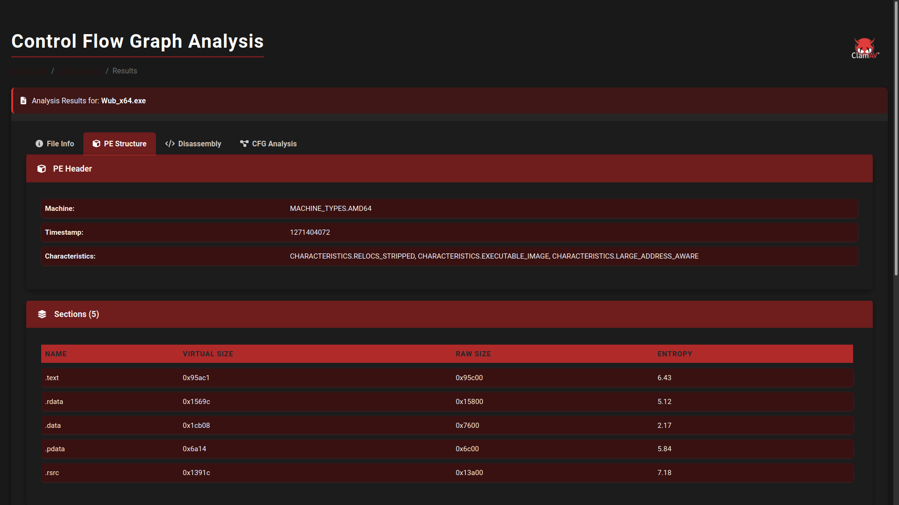
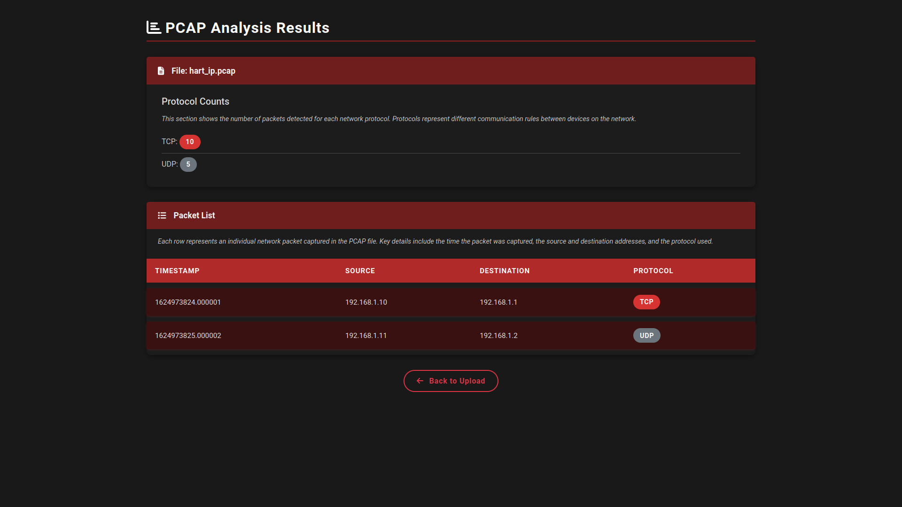

# 🛡️ ClamAV Console Web App

A cross-platform, web-based, open-source console for managing and automating **ClamAV** antivirus across remote **Linux** and **Windows** systems. This app provides tools for **remote installation**, **on-demand scanning**, **database updates**, **network topology visualization**, **IOC scanning**, **PCAP analysis**, and **malware analysis** — all from a single, secure dashboard.

---

## 🚀 Features

### Core ClamAV Management
- ✅ **Remote Installation** of ClamAV on Linux and Windows systems  
- 🔍 **Scan Local and Remote Systems** with ClamAV  
- 🔄 **Automatic Virus Database Updates** across multiple remote hosts  
- 🌐 **Network Scanning** to detect systems with ClamAV installed  

### Network Analysis
- 📊 **System Monitoring**: CPU, RAM, and network usage  
- 🔎 **PCAP Analysis** for network traffic inspection  
- 🌍 **Network Protocol Visualization**  

### Security Analysis
- 🔐 **IOC Scanning** with YARA rules and hash matching  
- 🧪 **Malware Analysis** with Pepper framework  
- 🕵️ **Control Flow Graph Analysis** for binary inspection  
- 📝 **File Metadata Analysis**  

### Platform Features
- 🧰 CLI and GUI elements powered by Flask + Jinja2  
- 📦 Multi-threaded with real-time logs using Server-Sent Events (SSE)  
- 🖥️ Cross-platform: supports both **Linux** and **Windows** servers  
- 🔐 **Login-Authenticated Dashboard** (Flask-Login)  

---

## 📸 Screenshots





---

## ⚙️ Installation

### 📋 Prerequisites

- Python 3.11+
- `pip` / `virtualenv`
- SSH access to remote systems
- ClamAV MSI for Windows installs (`clamav-1.*.*.win.x64.msi`) should be present on the server
- Optional dependencies for advanced features:
  - `libpcap` for PCAP analysis
  - `yara` for IOC scanning
  - `pepper` for malware analysis

### 🔧 Setup

```bash
git clone https://github.com/KYGnus/clamNET.git
cd clamNET
python3 -m venv venv
source venv/bin/activate  # On Windows: venv\Scripts\activate
pip install -r requirements.txt
```

**Note:** These requirements are for Python 3.11.13

### Advanced Feature Setup
For PCAP analysis:
```bash
sudo apt-get install libpcap-dev  # Debian/Ubuntu
sudo yum install libpcap-devel    # CentOS/RHEL
```

For Pepper analysis:
```bash
git clone https://github.com/KYGnus/pepper.git
cp pepper/pepper.py ./clamNET/
```

---

## 🔐 Default Login

| Username | Password |
| -------- | -------- |
| `config.USERNAME` | `config.PASSWORD` |

> ⚠️ **Change the admin password in `main.py` before deploying to production**:
> ```python
> ADMIN_PASSWORD_HASH = generate_password_hash('your_secure_password_here')
> ```

---

## ▶️ Running the App

```bash
python main.py
```

Then visit: [http://localhost:5005](http://localhost:5005)

---

## 🌐 Network Features

### Topology Scanning
Scan a network (e.g., `192.168.1.0/24`) to:
- Discover active hosts
- Detect OS via TTL analysis
- Visualize network structure
- Identify ClamAV installations

### PCAP Analysis
- Upload packet capture files (.pcap, .pcapng)
- Protocol distribution visualization
- Traffic pattern analysis
- Suspicious activity detection

---

## 🛠️ Usage Guide

### 🔧 ClamAV Installation
1. Navigate to the Install page
2. Enter target IPs (comma-separated)
3. Provide SSH credentials
4. The app will auto-detect OS and install the appropriate ClamAV version

### 🔄 Database Updates
1. Go to the Update page
2. Select target hosts
3. Monitor real-time update progress

### 🧪 Security Scanning
#### Basic Scanning:
- Select local or remote scan
- Choose directory path
- View real-time results

#### Advanced Scanning:
- **IOC Scanner**: Upload files for YARA rule matching and hash analysis
- **PCAP Analyzer**: Inspect network traffic patterns
- **Pepper Analysis**: Perform deep malware analysis on executables
- **CFG Analysis**: Examine binary control flow graphs

---

## 📁 File Structure

```text
.
├── main.py                # Main Flask application
├── modules/               # Additional functional modules
│   ├── pcap.py            # PCAP analysis
│   └── installer.py       # Remote installation
├── templates/             # HTML templates
├── static/                # CSS/JS assets
├── ioc_rules/             # YARA rules for IOC scanning
├── uploads/               # File upload directory
├── clamav-*.win.x64.msi   # Windows installer
├── pepper.py              # Malware analysis tool
└── requirements.txt       # Python dependencies
```

---

## 🧪 Tested Platforms

| OS         | Remote Install | Scanning | Update | IOC Scan | PCAP Analysis |
| ---------- | -------------- | -------- | ------ | -------- | ------------- |
| Ubuntu     | ✅              | ✅        | ✅      | ✅        | ✅             |
| openSUSE   | ✅              | ✅        | ✅      | ✅        | ✅             |
| Windows 10 | ✅              | ✅        | ✅      | ✅        | ✅             |
| macOS      | ❌              | ✅        | ❌      | ✅        | ✅             |

---

## 🤝 Contributing

1. Fork the repository
2. Create a feature branch: `git checkout -b feature-name`
3. Commit your changes: `git commit -m "Add feature"`
4. Push to your fork: `git push origin feature-name`
5. Submit a pull request

**Development Setup:**
```bash
pip install -r requirements-dev.txt
pre-commit install
```

---

## 📃 License

[MIT License](https://opensource.org/licenses/MIT) © 2025 KYGnus

---

## 📞 Contact

* **Koosha Yeganeh**
  - Email: [kygnus.co@proton.me](mailto:kygnus.co@proton.me)
  - Website: [kygnus.github.io](https://kygnus.github.io/)
  - GitHub: [@KYGnus](https://github.com/KYGnus)


